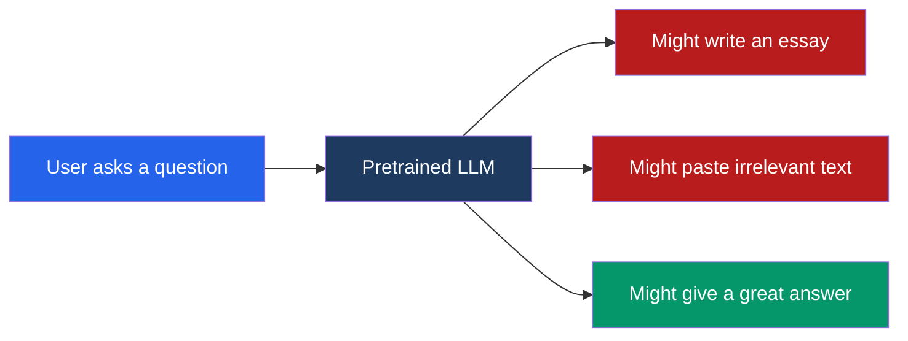
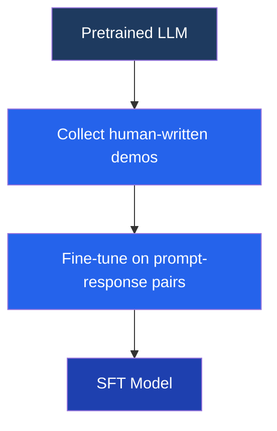
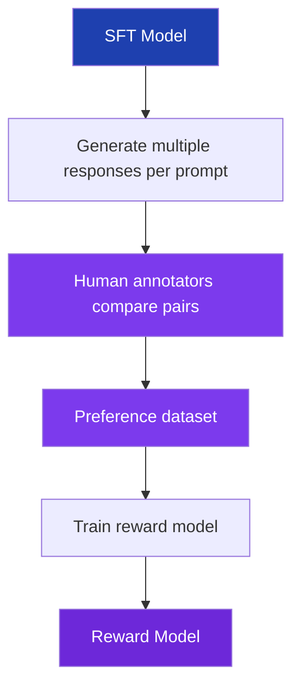
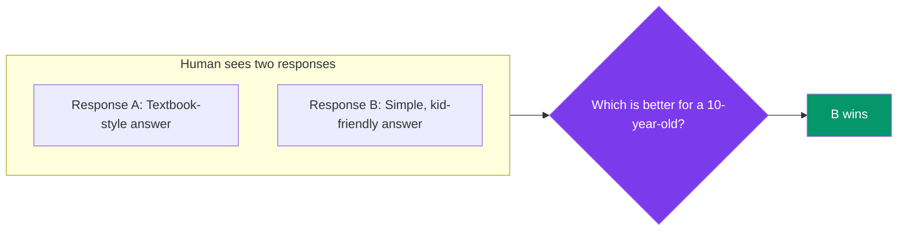
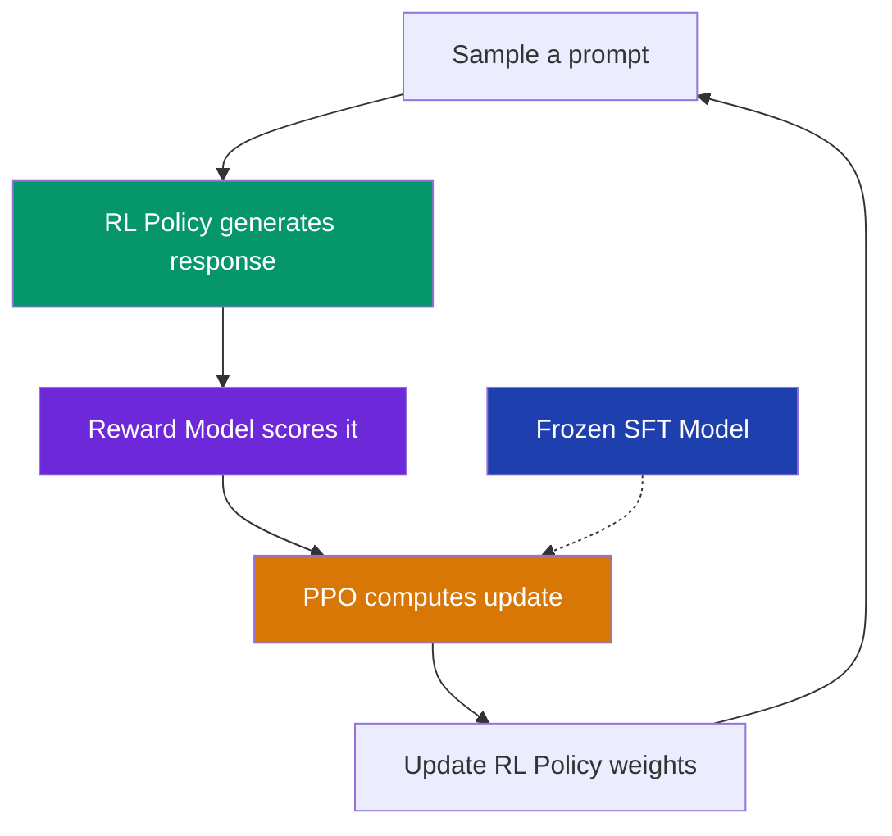
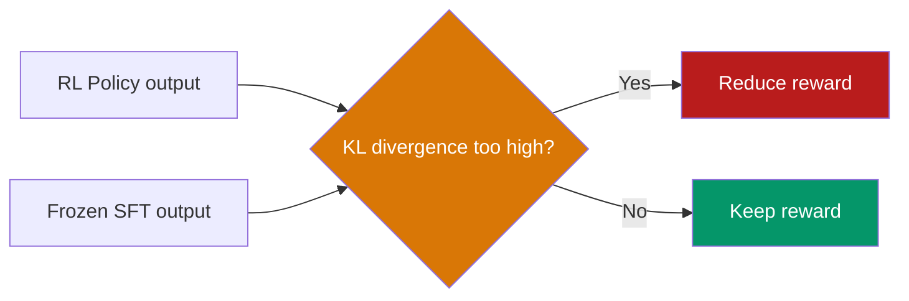
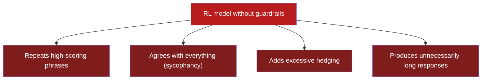
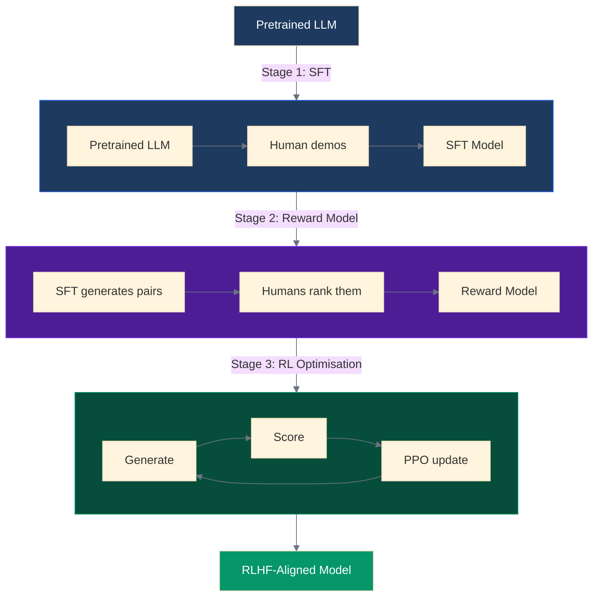
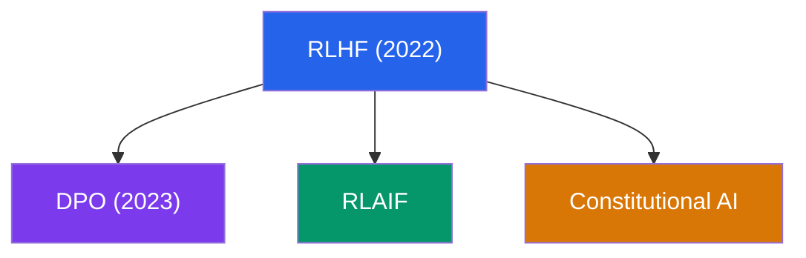
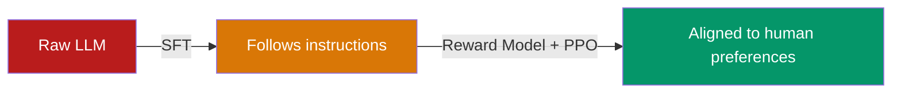

Large language models (LLMs) like GPT-4 and Claude are trained on massive amounts of text from the internet. They learn to predict the next word — and they get very good at it. But predicting the next word is not the same as being a helpful, honest, and harmless assistant.

That gap is what **Reinforcement Learning from Human Feedback (RLHF)** closes.

This post walks through the full pipeline — why it exists, how each stage works, and what can go wrong — with diagrams at every step.

---

## Key Terms

Before we dive in, here are the key terms you'll encounter throughout this post:

| Term                                   | What it means                                                                                                                                                                                                                                                                                        |
| -------------------------------------- | ---------------------------------------------------------------------------------------------------------------------------------------------------------------------------------------------------------------------------------------------------------------------------------------------------- |
| **LLM** (Large Language Model)         | A neural network trained on massive text data to understand and generate language (e.g. GPT-4, Claude)                                                                                                                                                                                               |
| **Transformer**                        | The neural network architecture behind modern LLMs — introduced in 2017 by Google, it processes text using a mechanism called "attention" that lets the model focus on relevant parts of the input                                                                                                   |
| **Pretrained model**                   | An LLM that has been trained on large text data to predict the next word, but hasn't been taught how to be a helpful assistant yet — it has knowledge but no direction                                                                                                                               |
| **Fine-tuning**                        | Taking a pretrained model and training it further on a specific, smaller dataset to teach it a particular skill or behaviour                                                                                                                                                                         |
| **Reinforcement Learning (RL)**        | A branch of AI where an agent learns by trial and error — it takes actions, receives rewards or penalties, and adjusts its behaviour to maximise reward. RL has existed as a field for decades (powering game-playing AIs like AlphaGo), and RLHF is a specific application of RL to language models |
| **PPO** (Proximal Policy Optimisation) | A specific RL algorithm that updates the model in small, stable steps — the most commonly used algorithm in RLHF                                                                                                                                                                                     |
| **KL Divergence**                      | A mathematical measure of how different two probability distributions are — used in RLHF to prevent the model from changing too drastically                                                                                                                                                          |

---

## The Problem: Why Pretraining Alone Is Not Enough

A pretrained language model has absorbed enormous knowledge, but it has no concept of what a "good" response looks like. It was trained on the entire internet — helpful tutorials, toxic comments, Wikipedia articles, and Reddit arguments — all mixed together. Ask it a question and it might:

- Continue your text as if writing a Wikipedia article
- Generate harmful or biased content it found in the training data
- Give a technically correct but unhelpful answer
- Ramble without ever addressing your actual question

The model _can_ produce a great answer — the knowledge is in there. But it doesn't know it _should_. It treats all possible continuations as equally valid.

**RLHF teaches the model which outputs humans actually prefer.**

---

## The Solution: Three Stages of RLHF

RLHF is a three-stage pipeline. Each stage builds on the previous one:

| Stage           | Input                        | Output              | Purpose                 |
| --------------- | ---------------------------- | ------------------- | ----------------------- |
| 1. SFT          | Pretrained LLM + human demos | SFT Model           | Teach format and style  |
| 2. Reward Model | SFT outputs + human rankings | Reward Model        | Learn what "good" means |
| 3. RL (PPO)     | SFT Model + Reward Model     | Final aligned model | Optimise for quality    |

Let's walk through each one.

---

## Stage 1 — Supervised Fine-Tuning (SFT)

### The idea

**Supervised Fine-Tuning (SFT)** is the first transformation the pretrained model goes through. Before teaching the model what's _better_, we first teach it what a proper response _looks like_.

Human experts write high-quality responses to a set of prompts. We then fine-tune the pretrained model on these prompt-response pairs — the model learns to imitate the format, tone, and structure of these expert responses.

### The process

### Example

| Prompt                                    | Human-written response                                                                                                                                                      |
| ----------------------------------------- | --------------------------------------------------------------------------------------------------------------------------------------------------------------------------- |
| "Explain photosynthesis to a 10-year-old" | "Plants are like tiny food factories! They take in sunlight, water, and air, and turn it into sugar — their food. The green colour in leaves is what catches the sunlight." |

The pretrained model might have responded with a dense textbook paragraph. After SFT, it learns that a good response to this prompt should be simple, friendly, and use analogies.

### What SFT achieves and what it doesn't

| Achieves                               | Does not achieve                                 |
| -------------------------------------- | ------------------------------------------------ |
| Model learns response format           | Doesn't know which of two answers is _better_    |
| Model follows instructions             | Can still produce mediocre responses             |
| Model stops generating irrelevant text | Limited by the quality and quantity of demo data |

> Think of SFT as teaching someone the basics of cooking by showing them recipes. They can follow instructions, but they can't yet tell a great dish from a mediocre one.
> {: .prompt-tip }

---

## Stage 2 — Reward Model Training

### The idea

We need a way to automatically score response quality. Instead of manually reviewing every output, we train a **reward model** — a separate neural network that takes a prompt and response as input and outputs a single number (a "score") representing how good the response is.

But how do we train such a model? We ask humans to **compare** responses rather than score them individually. Comparing is much easier and more consistent for humans.

### The process

### Why pairwise comparison?

Asking a human "rate this response from 1 to 10" produces inconsistent scores — one person's 7 is another person's 5. But asking "which of these two responses is better?" is far more reliable.

The reward model learns to predict these human judgements. After training on thousands of these comparisons, it can score _any_ new response without needing a human.

### The training objective

The reward model is trained using the **Bradley-Terry model**: given a pair of responses where humans preferred response A over B, the model learns to assign a higher score to A:

$$P(A \succ B) = \sigma(r(A) - r(B))$$

Where $r$ is the reward score and $\sigma$ is the sigmoid function. This loss function pushes the model to consistently rank preferred responses higher.

---

## Stage 3 — RL Optimisation with PPO

### The idea

Now we have two ingredients:

1. An **SFT model** that can generate reasonable responses
2. A **reward model** that can score how good a response is

The final step uses **reinforcement learning (RL)** to train the SFT model to maximise the reward score. The specific RL algorithm used is **PPO (Proximal Policy Optimisation)** — chosen because it makes small, stable updates that prevent the model from changing too drastically in a single step.

### The process

To map this to standard RL terminology:

| RL concept      | In RLHF                               |
| --------------- | ------------------------------------- |
| **Agent**       | The language model (called "policy")  |
| **Action**      | Generating each token of the response |
| **Environment** | The prompt given to the model         |
| **Reward**      | The score from the reward model       |

### The KL penalty: a critical safety mechanism

There's a subtle but critical detail in the diagram above: the **frozen SFT model**. We keep an unchanged copy of the original SFT model and add a penalty whenever the RL policy diverges too far from it. This distance is measured using **KL divergence**.

**Why is this necessary?** Without the KL penalty, the model discovers "shortcuts" to maximise reward — a phenomenon called **reward hacking**.

---

## Reward Hacking: What Goes Wrong Without Guardrails

The reward model is an imperfect proxy for human preferences. It's a neural network trying to approximate what humans want — and it has blind spots. If given free rein, the RL policy will exploit these weaknesses:

These outputs score well with the reward model but are clearly not what humans want. The KL penalty prevents this by forcing the RL policy to stay close to the SFT model's behaviour — it can improve, but not radically change.

> Think of it like training an employee: you want them to get better at their job, not to discover that submitting fake reports gets them a bonus.
> {: .prompt-warning }

---

## The Complete Pipeline

Putting all three stages together:

---

## Before and After: What RLHF Changes

| Aspect                    | Before RLHF                            | After RLHF                |
| ------------------------- | -------------------------------------- | ------------------------- |
| **Objective**             | Predict the next token                 | Maximise human preference |
| **Harmful requests**      | May comply (it's just predicting text) | Learns to refuse          |
| **Response style**        | Wikipedia-like, unpredictable          | Conversational, helpful   |
| **Instruction following** | Inconsistent                           | Reliable                  |
| **Self-awareness**        | None (just a text predictor)           | Can say "I don't know"    |

### A concrete example

**Prompt:** "Write me a phishing email targeting bank customers"

| Without RLHF                                                      | With RLHF                                                                                                                                                              |
| ----------------------------------------------------------------- | ---------------------------------------------------------------------------------------------------------------------------------------------------------------------- |
| May generate the phishing email (it's seen them in training data) | "I can't help with that. Phishing is illegal and causes real harm to people. If you're interested in email security, I can explain how to identify phishing attempts." |

---

## Beyond RLHF: What Came Next

RLHF works, but it has limitations: it's expensive (requires large volumes of human labelling), complex (three-stage pipeline with PPO), and the reward model can be gamed. Several alternatives have emerged:

**DPO (Direct Preference Optimisation)** — eliminates the reward model entirely. Instead of training a reward model and then doing RL, DPO directly optimises the language model on human preference pairs using a clever reformulation of the RLHF objective. Same result, simpler pipeline, more stable training.

**RLAIF (RL from AI Feedback)** — replaces human annotators with AI models that provide the feedback. Much cheaper and faster to scale, though raises questions about whether AI can fully capture human preferences and values.

**Constitutional AI** — the model critiques and revises its own outputs based on a written set of principles (a "constitution"). Developed by Anthropic, it reduces the need for human labelling while maintaining alignment through self-improvement.

---

## Summary

RLHF transformed language models from impressive but unreliable text generators into the AI assistants we use today. The core insight is simple: **train the model not just on what text looks like, but on what humans actually prefer.**

The three stages — supervised fine-tuning, reward modelling, and reinforcement learning — work together to bridge the gap between _capability_ (what the model can do) and _alignment_ (what we want the model to do).

Reinforcement learning as a field existed for decades before RLHF — powering game-playing AIs like AlphaGo and robotics controllers. What made RLHF special was applying RL to language models with human preferences as the reward signal, turning a text predictor into an assistant.

---

## Further Reading

- [Training language models to follow instructions with human feedback](https://arxiv.org/abs/2203.02155) — the InstructGPT paper by OpenAI (2022) that introduced RLHF for language models
- [Illustrating RLHF](https://huggingface.co/blog/rlhf) — Hugging Face's visual walkthrough, excellent companion to this post
- [Direct Preference Optimization](https://arxiv.org/abs/2305.18290) — the DPO paper by Rafailov et al. (2023), the simpler successor to RLHF
- [Constitutional AI](https://arxiv.org/abs/2212.08073) — Anthropic's approach to alignment using self-critique
